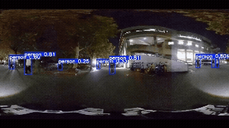
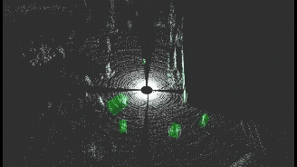

# OODIS: Omnidirectional Object Detection and Tracking for Industrial Safety
<p align="center">
  
  
  
  
</p>


<p align="center">
   
</p>

📄 **Paper**: [OODIS 산업 안전을 위한 전방위 객체 탐지 시스템](docs/OODIS%20%EC%82%B0%EC%97%85%20%EC%95%88%EC%A0%84%EC%9D%84%20%EC%9C%84%ED%95%9C%20%EC%A0%84%EB%B0%A9%EC%9C%84%20%EA%B0%9D%EC%B2%B4%20%ED%83%90%EC%A7%80%20%EC%8B%9C%EC%8A%A4%ED%85%9C.pdf)  
📌 **KRoC 2026 논문 투고**

## 📑 Overview
- [Introduction](#-introduction)  
- [Key Features](#-key-features)  
- [Used Sensor](#-used-sensor)  
- [Camera–LiDAR Calibration](#-cameralidar-calibration)  
- [Pineline](#-pineline)  
&nbsp;&nbsp;&nbsp;[1. 2D Detection (DINO)](#1-2d-detection-dino)  
&nbsp;&nbsp;&nbsp;[2. Tracking (OC-SORT)](#2-tracking-oc-sort)  
&nbsp;&nbsp;&nbsp;[3. 3D Detection (Ultratics ROS)](#3-3d-detection-ultratics-ros)  
- [Results](#-results)  
- [Getting Started](#-getting-started)  
&nbsp;&nbsp;&nbsp;[1. Installation](#1-installation)  
&nbsp;&nbsp;&nbsp;[2. How to run](#2-how-to-run)  
&nbsp;&nbsp;&nbsp;[3. Docker](#3-docker)  
- [Paper](#-paper)  
- [References](#-references)
## 🚀 Introduction


OODIS는 360° 카메라와 360° LiDAR를 결합한 전방위 감지 시스템을 제공하며,
ERP 기반 2D 투영과 DINO + OC-SORT로 안정적인 탐지·추적을 수행한다.
지게차와 로봇 모두에 장착 가능하며, 실내·실외·공장 환경에서 일관된 성능을 보였다.

## 🔑 Key Features
- **360° Full Surround Perception** <br>
&nbsp;&nbsp;&nbsp;◦ 단일 360° 카메라 + 360° LiDAR로 전 방향 감지 <br>
&nbsp;&nbsp;&nbsp;◦ 추가적인 센서 마운트 고민 없이 플랫폼 독립적 구성

- **ERP 기반 고효율 포인트 매칭**<br>
&nbsp;&nbsp;&nbsp;◦ 3D LiDAR 포인트를 ERP로 투영<br>
&nbsp;&nbsp;&nbsp;◦ 계산량 감소 : 복잡한 3D-3D 매칭 대신 2D bbox 조건 기반 매칭<br>

- **Robust Object Detection**<br>
&nbsp;&nbsp;&nbsp; ◦ DINO: 왜곡이 있는 ERP 이미지에서도 강건한 특징 추출<br>
&nbsp;&nbsp;&nbsp; ◦ OC-SORT: 빠르고 안정적인 multi-object tracking 제공<br>

- **Real-World Industrial Evaluation**<br>
&nbsp;&nbsp;&nbsp;◦ 실제 CJ 산업 공장, 학교 실내, 야간 실외 환경에서 테스트<br>
&nbsp;&nbsp;&nbsp;◦ AP, MOTA, IDF1 기반 정량 평가<br>
&nbsp;&nbsp;&nbsp;◦ 위험도 시각화 기반 실사용 가능성 검증

## 🤖 Used Sensor


<br>

**1. Ricoh Theta Z1 (360° Camera)**
<br>
**2. Livox Mid-360 (360° LiDAR)**
<br>
**3. Custom Integrated Sensor Mount**

## 📐 Camera–LiDAR Calibration

360° Camera와 3D LiDAR의 좌표계를 정합하기 위해
[Direct Visual-LiDAR Calibration](https://github.com/koide3/direct_visual_lidar_calibration)을 활용하여
**RICOH THETA Z1–Livox Mid-360 간 Extrinsic Calibration**을 수행했습니다.

<p align="center">
  
</p>

- **Camera**: RICOH THETA Z1 (360° Equirectangular Image)
- **LiDAR**: Livox Mid-360
- 360° 영상과 LiDAR Point Cloud를 이용해 두 센서 간 **회전·이동 변환값(Extrinsic Transform)** 산출
- 산출된 변환값을 적용해 LiDAR Point를 Camera 좌표계로 변환
- 3D LiDAR Point를 360° 파노라마 영상에 재투영하여 정합 결과 검증
- Calibration 결과는 이후 3D Detection 단계의 **LiDAR–Camera 좌표변환 및 2D–3D Sensor Fusion**에 활용

## 🛠 Pineline


### 1. 2D Detection (DINO)
- ERP로 변환된 2D 이미지를 입력 받아 사람 bbox 검출
- Self-attention을 활용해 왜곡에 강한 전역 객체 특징 추출
  
### 2. Tracking (OC-SORT)
- DINO에서 검출된 bbox를 입력받아 프레임 간 ID 유지
- 공장 환경의 많은 가림(occlusion)을 고려하여 강건한 추적
  
### 3. 3D Detection (Ultratics ROS)
- 라이다 포인트를 카메라 프레임으로 변환 (extrinsic 사용)
- ERP(equirectangular)로 3D → 2D 매핑
- 포인트(u, v)가 bbox 내부인지 여부로 매칭
-  매칭된 포인트만 다시 3D 좌표로 복원 → 객체까지 거리 계산
  
## 📊 Results

<br>

### Detection Performance (AP / CD)
| Environment | AP    | CD(px) |
|:-----------:|:-----:|:------:|
| Factory     | 0.588 | 24     |
| Indoor      | **0.700** | 27 |
| Outdoor(Night)| 0.095 | 30   |

### Tracking Performance (MOTA / IDF1)
| Environment | MOTA    | IDF1 |
|:-----------:|:-----:|:------:|
| Factory       | **89.1** | 83.5    |
| Indoor        | 76.7 | **84.9**    |
| Outdoor(Night)| 53.4 | 67.2  |


## 🔧 Getting Started

### 1. Installation

#### 1. RTX 30 Series
**test : Python=3.8, PyTorch=1.12.1, Torchvision=0.13.1, CUDA=11.6**
<br>
**i. Setting**
```
pip install torch==1.12.1+cu116 torchvision==0.13.1+cu116 \
  --extra-index-url https://download.pytorch.org/whl/cu116
```

**ii. Build package**
```
git clone https://github.com/happious/3d_detection
cd 3d_detection
pip install -r requirements.txt
```
```
cd src/ultralytics_ros/DINO
mkdir weights
mv ~/Downloads/checkpoint0029_4scale_swin.pth ~/3d_detection/src/ultralytics_ros/DINO/weights/
```
```
cd ..
mkdir bag
mv ~/your.bag ~/3d_detection/src/ultralytics_ros/bag
```

**iii. Catkin make**
```
cd ~/3d_detection
catkin_make
source devel/setup.bash
```
---

### 2. How to run
```
roslaunch ultralytics_ros tracking.launch
```
```
roslaunch ultralytics_ros tracker_with_cloud_ros1.launch
```
---

### 3. Docker

#### 3D Detection + DINO + OC-SORT (ROS Noetic + Docker)
Ubuntu 20.04 · ROS Noetic · PyTorch 1.12.1 + cu116  


**3.1 Create Workspace (Host)**

```bash
mkdir -p ~/your_ws
cd ~/your_ws
```


**3.2 Clone 3d_detection Source (Host)**

```bash
cd ~/your_ws
git clone https://github.com/happious/3d_detection.git
```


**3.3 Prepare DINO Weights (Host)**

```bash
mkdir -p ~/your_ws/3d_detection/src/ultralytics_ros/DINO/weights
cp ~/Downloads/checkpoint0011_4scale.pth \
   ~/your_ws/3d_detection/src/ultralytics_ros/DINO/weights/
```


**3.4 Prepare Bag File (Host)**

```bash
mkdir -p ~/your_ws/3d_detection/src/ultralytics_ros/bag
cp ~/CJ.bag \
   ~/your_ws/3d_detection/src/ultralytics_ros/bag/
```


**3.5 Create Dockerfile (Host)**

Create the file: ~/your_ws/Dockerfile

```bash
mv ~/your_ws/3d_detection/docker/Dockerfile ~/your_ws/Dockerfile
```


**3.6 Allow x11(Host)**

```bash
xhost +local:docker
```


**3.7 Build Docker Image (Host)**

```bash
cd ~/your_ws
docker build -t 3d_detection_dino .
```


**3.8 Run Container with GUI + Volume Mount**

```bash
docker run --gpus all -it \
  --name dino_container \
  -v ~/your_ws/3d_detection:/opt/catkin_ws/src/3d_detection \
  -e DISPLAY=$DISPLAY \
  -v /tmp/.X11-unix:/tmp/.X11-unix \
  --env="QT_X11_NO_MITSHM=1" \
  3d_detection_dino
```
**3.9 Build DINO CUDA Ops**
```bash
cd /opt/catkin_ws/src/3d_detection/src/ultralytics_ros/DINO/models/dino/ops

# Clean build
pip3 uninstall -y MultiScaleDeformableAttention || true
rm -rf build/ dist/ MultiScaleDeformableAttention.egg-info
find . -name "MultiScaleDeformableAttention*.so" -delete || true

# CUDA 11.6 build
export CUDA_HOME=/usr/local/cuda

FORCE_CUDA=1 python3 setup.py build_ext --inplace
FORCE_CUDA=1 python3 -m pip install .

# import test
python3 - << 'EOF'
import torch
import MultiScaleDeformableAttention as MSDA
print("torch:", torch.__version__, "cuda:", torch.version.cuda)
print("cuda.is_available:", torch.cuda.is_available())
print("MSDA:", MSDA)
EOF
```


**3.10 Launch**

**Terminal 1**
```bash
cd /opt/catkin_ws
roslaunch ultralytics_ros tracking.launch
```

**Terminal 2**
```bash
docker exec -it dino_container bash
roslaunch ultralytics_ros tracker_with_cloud_ros1.launch
```


**Terminal 3**
```bash
docker exec -it dino_container bash
rviz
```


## 📄 Paper

- **KRoC 2026 논문 투고**
- **논문명**: OODIS 산업 안전을 위한 전방위 객체 탐지 시스템
- [논문 보기](docs/OODIS%20%EC%82%B0%EC%97%85%20%EC%95%88%EC%A0%84%EC%9D%84%20%EC%9C%84%ED%95%9C%20%EC%A0%84%EB%B0%A9%EC%9C%84%20%EA%B0%9D%EC%B2%B4%20%ED%83%90%EC%A7%80%20%EC%8B%9C%EC%8A%A4%ED%85%9C.pdf)

> 논문 PDF는 저장소의 `docs/` 폴더에 포함되어 있습니다.

---

## 📕 References
[1] DINO : https://github.com/IDEA-Research/DINO
<br>
[2] OC-SORT : https://github.com/noahcao/OC_SORT
<br>
[3] ultralytics_ros : https://github.com/Alpaca-zip/ultralytics_ros
